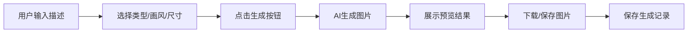

## 1. 产品概述
2D游戏素材生成工具，通过AI文生图技术帮助游戏开发者快速生成各类2D游戏素材。
- 目标用户：独立游戏开发者、像素艺术家、游戏美术设计师
- 核心价值：降低游戏素材制作成本，提升创作效率，支持多种风格和尺寸输出

## 2. 核心功能

### 2.1 用户角色
| 角色 | 注册方式 | 核心权限 |
|------|----------|----------|
| 普通用户 | 无需注册 | 使用所有生成、下载、历史记录功能 |

### 2.2 功能模块
1. **素材生成页面**：文生图输入、参数配置、生成预览、下载操作
2. **生成记录模块**：历史记录列表、重新生成、复制提示词、删除记录

### 2.3 页面详情
| 页面名称 | 模块名称 | 功能描述 |
|-----------|-------------|---------------------|
| 素材生成页 | 素材描述输入 | 多行文本输入，支持详细描述素材内容 |
| 素材生成页 | 素材类型选择 | 下拉选择：角色、怪物、道具、武器、背景、图标 |
| 素材生成页 | 画风选择 | 下拉选择：像素风、卡通风、手绘风、日系RPG、暗黑奇幻、赛博朋克、低多边形2D |
| 素材生成页 | 尺寸选择 | 下拉选择：32x32至1024x1024共6种尺寸 |
| 素材生成页 | 生成按钮 | 触发生成操作，带加载状态 |
| 素材生成页 | 图片预览 | 展示生成结果，支持占位状态 |
| 素材生成页 | 下载操作 | PNG下载、JPG下载、自定义文件名、保存到素材库 |
| 素材生成页 | 最近生成记录 | 展示历史记录卡片，支持重新生成、复制、删除 |

## 3. 核心流程
用户输入素材描述 → 选择类型/画风/尺寸参数 → 点击生成 → 系统调用AI接口生成图片 → 展示预览结果 → 用户下载或保存图片 → 自动记录生成历史

## 4. 用户界面设计
### 4.1 设计风格
- **主色调**：深靛蓝 (#1e1b4b) 作为主色，霓虹紫 (#a855f7) 作为强调色
- **辅助色**：电蓝 (#3b82f6)、青绿色 (#06b6d4)、琥珀橙 (#f59e0b)
- **背景**：深色渐变背景，带像素点阵纹理
- **按钮风格**：圆角霓虹发光按钮，悬停时有脉冲光晕效果
- **字体**：展示字体使用 Press Start 2P（像素风格），正文字体使用 JetBrains Mono
- **布局风格**：卡片式两栏布局 + 底部记录区，深色游戏主题UI
- **图标风格**：Lucide 图标，霓虹发光效果

### 4.2 页面设计概述
| 页面名称 | 模块名称 | UI元素 |
|-----------|-------------|-------------|
| 素材生成页 | 顶部标题栏 | 像素风格标题、霓虹发光效果、装饰性像素边框 |
| 素材生成页 | 左侧输入区 | 深色玻璃态卡片、霓虹边框、像素风格输入框 |
| 素材生成页 | 右侧预览区 | 大尺寸预览画布、棋盘格透明背景、霓虹发光操作按钮 |
| 素材生成页 | 底部记录区 | 横向滚动卡片列表、像素缩略图、悬停发光效果 |

### 4.3 响应式
- 桌面端：两栏布局（输入区 + 预览区）+ 底部记录区
- 平板端：上下堆叠布局
- 移动端：单列布局，记录区改为竖向滚动
- 触摸优化：按钮最小触控区域 44x44px

### 4.4 视觉特效
- 像素扫描线动画覆盖层
- 按钮霓虹脉冲光晕
- 卡片悬停时的霓虹边框流动效果
- 图片加载时的像素化渐显动画
- CRT显示器微弯曲效果
