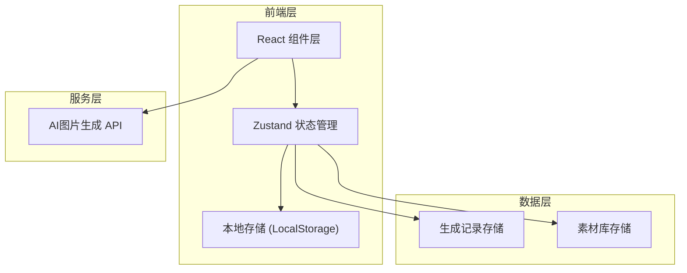
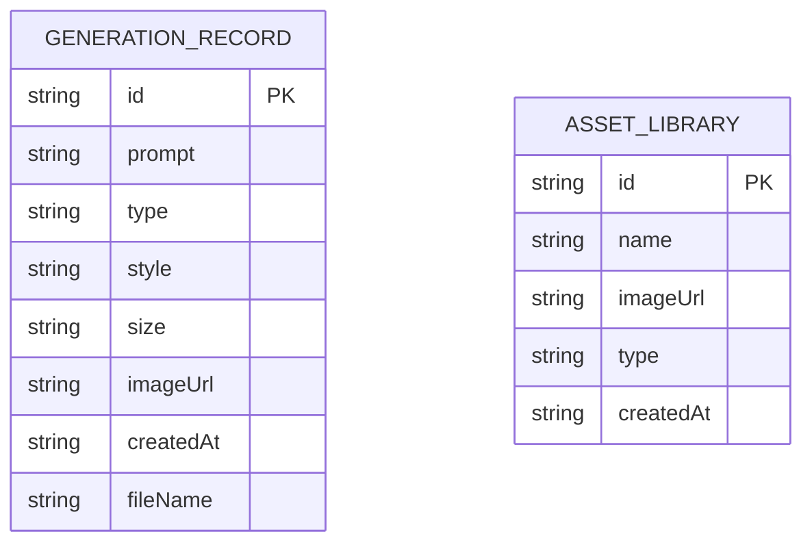

## 1. 架构设计



## 2. 技术描述
- **前端框架**: React@18 + TypeScript + Vite
- **样式方案**: TailwindCSS@3
- **状态管理**: Zustand
- **图标库**: Lucide React
- **图片生成**: 集成 text_to_image API
- **数据持久化**: LocalStorage 存储生成记录和素材库
- **初始化工具**: vite-init

## 3. 路由定义
| 路由 | 用途 |
|-------|---------|
| / | 主页 - 素材生成工具主界面 |

## 4. API 接口定义

### 图片生成接口
```typescript
interface GenerateImageParams {
  prompt: string;
  image_size: 'square_hd' | 'square' | 'portrait_4_3' | 'portrait_16_9' | 'landscape_4_3' | 'landscape_16_9';
}

interface GenerateImageResponse {
  url: string;
  success: boolean;
  error?: string;
}
```

## 5. 数据模型

### 5.1 数据模型定义



### 5.2 TypeScript 类型定义

```typescript
type AssetType = 'character' | 'monster' | 'item' | 'weapon' | 'background' | 'icon';
type ArtStyle = 'pixel' | 'cartoon' | 'handdrawn' | 'japanese-rpg' | 'dark-fantasy' | 'cyberpunk' | 'low-poly-2d';
type ImageSize = '32x32' | '64x64' | '128x128' | '256x256' | '512x512' | '1024x1024';
type ImageFormat = 'png' | 'jpg';

interface GenerationRecord {
  id: string;
  prompt: string;
  type: AssetType;
  style: ArtStyle;
  size: ImageSize;
  imageUrl: string;
  createdAt: string;
  fileName: string;
}

interface LibraryAsset {
  id: string;
  name: string;
  imageUrl: string;
  type: AssetType;
  createdAt: string;
}

interface GeneratorState {
  prompt: string;
  type: AssetType;
  style: ArtStyle;
  size: ImageSize;
  currentImage: string | null;
  isGenerating: boolean;
  records: GenerationRecord[];
  library: LibraryAsset[];
}
```

## 6. 项目目录结构
```
src/
├── components/
│   ├── InputPanel.tsx       # 左侧输入配置面板
│   ├── PreviewPanel.tsx     # 右侧预览面板
│   ├── HistoryPanel.tsx     # 底部历史记录面板
│   ├── DownloadModal.tsx    # 下载选项弹窗
│   ├── HistoryCard.tsx      # 历史记录卡片组件
│   └── PixelButton.tsx      # 像素风格按钮组件
├── hooks/
│   └── useImageGenerator.ts # 图片生成逻辑Hook
├── store/
│   └── useGeneratorStore.ts # Zustand状态管理
├── types/
│   └── index.ts             # TypeScript类型定义
├── utils/
│   ├── imageUtils.ts        # 图片处理工具函数
│   ├── promptUtils.ts       # 提示词构造工具
│   └── storageUtils.ts      # 本地存储工具
├── pages/
│   └── Home.tsx             # 主页组件
├── App.tsx
├── main.tsx
└── index.css
```
